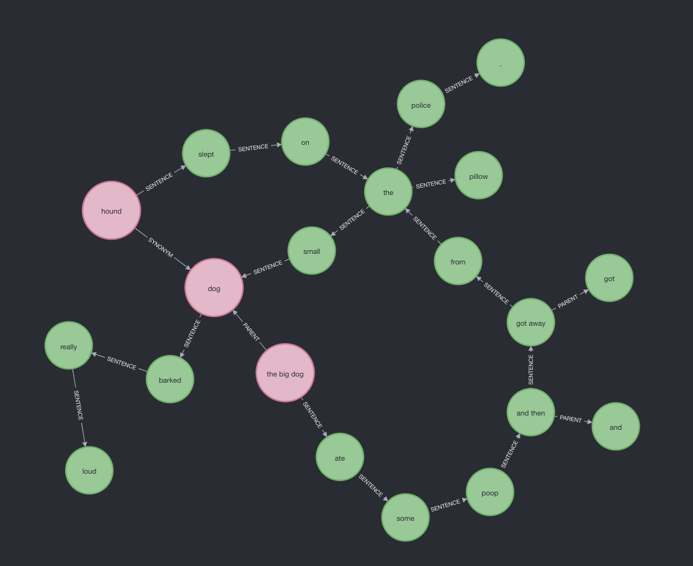

# Logos: Neomodel - Docker - Natural Language To Graph

Logos is the foundation upon a NLP application can be build using Docker and Django Neomodel.
It receives document in a form of a string and it generates a graph which represents the given text.
Then someone can easily query with Cypher. Logos also automatically generates rules from the 
given text that can be used to link together future entities.

On the above image we see the graph representation of the following three sentences:
1. `the big dog ate some poop and then got away from the police.`
2. `the small dog barked really loud`
3. `hound slept on the pillow `

The above graph can be easily generated by executing the `logos.web.core.analysis.document_analysis` 
with the appropriate text or by executing the test `test_entity_graph_without_cache` while 
changing again the text.

## Installation

1. Install [docker](https://docs.docker.com/engine/install/ubuntu/) and [docker-compose](https://docs.docker.com/compose/install/).
2. Clone the logos repository.
3. Run in the cloned folder: `docker-compose build`
4. Run `docker-compose up`

#### Every thing is ready! You can generate new graphs and query them in http://localhost:7474/browser/

## Entity Graph Generation - Explained

As mentioned someone can easily generate any graph by running the method `logos.web.core.analysis.document_analysis`.
This method will perform the following for every sentence.

1. It will assign a unique id to the given document and sentences help querying in the future
2. It will perform chunking and it will split the sentence into [Noun-Chunk] - [Verb-Chunk] - [Adjective-Chunk]
3. It will divide the sentences into phrases. For example from the above image we can see that
the phrase `got away` is one node
4. It will generate a graph.
    1. Each noun chunk is represented as an EntitySet. These entity sets have properties where the property
    name is the verb chunk and the property value the adjective chunk. For each entity set we generate an additional
    node from the root of the noun chunk which represent the parent of the entity set and we link them with the appropriate
    relationship.
    2. Every other node is represented by an entity.
    3. Every entity set and entity from the same sentence are connected with a SENTENCE relationship which is characterised 
    from the ids mentioned above and the order of the entity in the sentence.
4. It will attempt to generate rules from the given sentence which in the future they could be used to draw relationships between new 
entities. The rule execution part has not been developed yet.
    1. Parental Rules: Based on the shared properties between entity sets we can assume that two entity sets are disjoint, siblings or
    the first is the parent of the second and vice versa.
    2.  CommonPropertiesRule: If two entity sets share the same tokens except the root, for example `the big dog` and `the big cat`, 
    and also have common properties, then we can assume that the shared properties derive from the shared tokens. 
    So when we find the same tokens in an entity set then we can automatically apply those properties.
    For example the property `does not fit - in the small box` if it is shared in the above entity sets then we can assume 
    that every entity set with the tokens `the big X` has the mentioned property.
    
## Conclusion

With this repository someone can explore how a django neomodel and docker nlp application can be created.
If we generate a big graph then querying this graph can be challenging and an optimization of the graph architecture 
might be needed.
